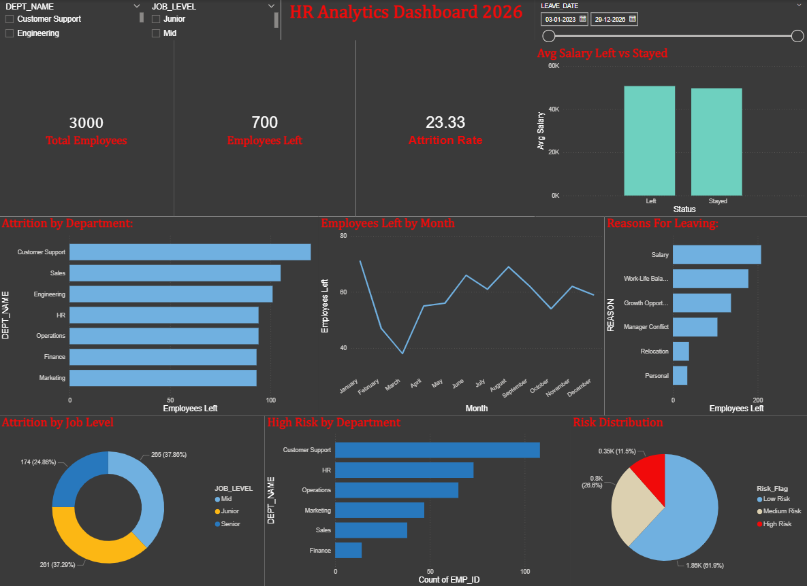

# 📊 HR Analytics — Employee Attrition Analysis

<p align="center">
  
</p>

<p align="center">
  
  
  
</p>

---

## 🚨 The Business Problem

> *"The organization is losing 1 in 4 employees every year.*
> *The management wants answers — Who is leaving? Why? Who is at risk next?"*

As a **Data Analyst**, I took on this challenge:
- 🔍 Investigated **root causes** of 23% attrition rate
- 🎯 Identified **at-risk employees** before they resign
- 💡 Delivered **actionable recommendations** to reduce attrition by 10%

> **This is not just a SQL project — this is a real business problem solved with data.**

---

## 🎯 Key Results At A Glance

| Metric                            | Value            | Status            |
|-----------------------------------|------------------|-------------------|           
| Overall Attrition Rate            | 23.33%           | 🔴 Critical      |
| Most Affected Department          | Customer Support | 🔴 High Risk     |
| Top Reason For Leaving            | Salary           | ⚠️ Action Needed |
| Employees Never Promoted Who Left | 69%              | ⚠️ Action Needed |
| Junior Attrition                  | 37.86%           | ⚠️ Monitor       |
| Employees Currently Low Risk      | 61.9%            | 🟢 Stable        |

---

## 💡 5 Business Recommendations

> These are not just observations — these are decisions HR can act on **today.**

**1. 💰 Salary Benchmarking**
Employees who left earned on average less than those who stayed.
Conduct immediate salary benchmarking — especially in Customer Support.

**2. 📈 Fix The Promotion Gap**
69% of employees who left were **never promoted in 3 years.**
Introduce a clear promotion policy with annual performance-linked reviews.

**3. 👔 Manager Training Program**
Manager Conflict is the 4th biggest reason for attrition.
Invest in leadership training — bad managers cost more than their salary.

**4. 🎓 Junior Employee Retention**
37.86% of attrition comes from Junior employees.
Create structured career growth paths, mentorship programs and skill development plans.

**5. 📅 Proactive Monthly Monitoring**
January sees the highest resignations — likely post-appraisal disappointment.
Run retention campaigns and salary reviews in Q4 before the spike hits.

---

## 📈 Dashboard Preview

> Built in Power BI with 8 interactive visuals and 3 slicers

<p align="center">
  
</p>

### What The Dashboard Shows
| Visual                  | Insight                                                 |
|-------------------------|---------------------------------------------------------|
| KPI Cards               | Total Employees, Attrition Rate, Avg Salary at a glance |
| Attrition by Department | Which teams are bleeding talent                         |
| Monthly Trend           | When resignations spike through the year                |
| Reasons For Leaving     | What is actually driving people out                     |
| Job Level Donut         | Which seniority level is most at risk                   |
| Salary Left vs Stayed   | Is salary really the reason?                            |
| Risk Distribution       | How many employees are High/Medium/Low risk             |
| High Risk by Department | Where to focus retention efforts first                  |

---

## 🔍 SQL Analysis — 24 Business Driven Queries

> Every query answers a real business question — not just practice exercises.

| Chapter                  | Business Question                                 | SQL Concepts                |
|--------------------------|---------------------------------------------------|-----------------------------|
| 1 — Workforce Overview   | Who works here and how are we structured?         | SELECT, JOIN, GROUP BY, AVG |
| 2 — Attrition Deep Dive  | Where is the bleeding happening and why?          | COUNT, LEFT JOIN, HAVING    |
| 3 — Salary & Performance | Are we paying fairly? Are top performers staying? | Subqueries, CASE WHEN       |
| 4 — Predictive Insights  | Who is most likely to leave next?                 | Window Functions, RANK()    |
| 5 — Business Automation  | Package insights for the business                 | Views, Stored Procedures    |

### Complete SQL Skills Used
```
✅ SELECT, WHERE, ORDER BY, LIMIT
✅ GROUP BY, HAVING
✅ INNER JOIN, LEFT JOIN, RIGHT JOIN
✅ Aggregate Functions — COUNT, AVG, MIN, MAX, ROUND
✅ Subqueries and Correlated Subqueries
✅ CASE WHEN — Attrition Risk Scoring
✅ Window Functions — RANK(), DENSE_RANK(), SUM() OVER()
✅ DATE Functions — DATE_FORMAT(), YEAR(), MONTH()
✅ CREATE VIEW — attrition_risk_employees
✅ Stored Procedures — GetDepartmentHealthReport, FlagAtRiskEmployees
```

---

## 🗃️ Database Design

```
┌─────────────┐     ┌──────────────┐     ┌─────────────┐
│ departments │────<│   employee   │>────│  attrition  │
└─────────────┘     └──────┬───────┘     └─────────────┘
                           │
               ┌───────────┴───────────┐
               │                       │
        ┌──────▼──────┐      ┌─────────▼──────┐
        │ performance │      │  recruitment   │
        └─────────────┘      └────────────────┘
```

### Dataset Scale

| Table       | Records | Description              |
|-------------|---------|--------------------------|
| employee    | 3,000   | Full employee profiles   |
| performance | 11,000+ | Annual reviews 2023–2026 |
| attrition   | 700     | Employees who left       |
| departments | 7       | Company departments      |
| recruitment | 3,000   | Hiring source tracking   |

---

## 🚀 How To Run This Project

```sql
-- Step 1: Create database
CREATE DATABASE hr_analytics;
USE hr_analytics;

-- Step 2: Create all 5 tables using schema in SQL_Queries folder
-- Step 3: Import CSV files from Dataset folder
-- Step 4: Run all 25 queries from hr_Analytics_project.sql
-- Step 5: Open hr_analytics.pbix in Power BI Desktop
```

---

## 📂 Project Structure

```
HR-Analytics-SQL/
│
├── 📁 Dataset/               ← Raw data files
│     ├── employee.csv
│     ├── departments.csv
│     ├── performance.csv
│     ├── attrition.csv
│     └── recruitements.csv
│
├── 📁 SQL_Queries/           ← All 24 SQL queries
│     └── hr_Analytics_project.sql
│
├── 📁 Dashboard/             ← Power BI files
│     ├── hr_analytics.pbix
│     └── Dashboard_Screenshot.png
│
└── README.md
```

---

## 🛠️ Tools & Technologies

<p>
  
  
  
</p>

---

## 👩‍💻 About The Author

**Shristi Sharma**
BSc Computer Science Graduate | MYSQL | POWERBI | Turning raw data into business decisions

[](https://www.linkedin.com/in/shristi-sharma-0a4367370/)
[](https://github.com/ShristiSharma03)

---

<p align="center">
  ⭐ If you found this project useful, please give it a star! It means a lot! ⭐
</p>
